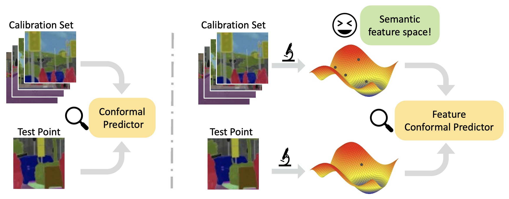

# FeatureCP

> [**Predictive Inference with Feature Conformal Prediction**](https://arxiv.org/pdf/2210.00173.pdf) **(Accepted by ICLR 2023)**
>
>[Jiaye Teng*](https://www.tengjiaye.com/), [Chuan Wen*](https://alvinwen428.github.io/), [Dinghuai Zhang*](https://zdhnarsil.github.io/),
>[Yoshua Bengio](https://yoshuabengio.org/), [Yang Gao](https://yang-gao.weebly.com/), [Yang Yuan](http://people.iiis.tsinghua.edu.cn/~yuanyang/en.html)




## 1. Installation

We use Python 3.7, and other packages can be installed by:
```
pip install -r requirements.txt
```

## 2. Run FeactureCP

### 2.1 One-dim datasets

The 1-dim datasets include Community, Facebook1, Facebook2, Meps19, Meps20, Meps21,
Star, Blog, Bio and Bike, which have been placed in `./datasets/`.
The results of FeatureCP on these datasets can be obtained by the following commands:
```
python main.py --data com --no-resume --seed 0 1 2 3 4
python main.py --data fb1 --no-resume --seed 0 1 2 3 4
python main.py --data fb2 --no-resume --seed 0 1 2 3 4
python main.py --data meps19 --no-resume --seed 0 1 2 3 4
python main.py --data meps20 --no-resume --seed 0 1 2 3 4
python main.py --data meps21 --no-resume --seed 0 1 2 3 4
python main.py --data star --no-resume --seed 0 1 2 3 4
python main.py --data blog --no-resume --seed 0 1 2 3 4
python main.py --data bio --no-resume --feat_lr 0.001 --seed 0 1 2 3 4
python main.py --data bike --no-resume --feat_lr 0.001 --seed 0 1 2 3 4
```

### 2.2 High-dimensional datasets
#### Synthetic dataset:
```
python main.py --data x100-y10-reg --no-resume --feat_lr 0.001 --feat_step 80 --seed 0 1 2 3 4
```

#### Cityscapes

Cityscapes is a commonly-used semantic segmentation dataset.
Please download it from the [official website](https://www.cityscapes-dataset.com/).

The [FCN](https://arxiv.org/abs/1411.4038) model need to firstly be trained on Cityscapes with the codebase in `./FCN-Trainer/`.
We also provide the checkpoint trained by us in this [link](https://drive.google.com/file/d/1snj6caNRM454rC5LxxJsXA5BLuFuTINQ/view?usp=sharing).
Please train the FCN to get the model checkpoint or simply download our checkpoint, and move it into `./ckpt/cityscapes/`.

**Note**: As discussed in Section 5.1 and Appendix B.1 in [our paper](https://arxiv.org/pdf/2210.00173.pdf), we transform the
original pixel-wise classification problem into a high-dimensional pixel-wise regression problem. Specifically, we convert the label space from $[0, 1]$ to
$(−\infty, +\infty)$ by the double log trick, i.e., $\dot{y}=log(-log(\tilde{y}))$.
Therefore, if you want to visualize the estimated length as Figure 3 or evaluate the mIoU of the provided FCN model, 
you need to convert the output space to the original label space by `output = torch.exp(-torch.exp(output))`.

The command to execute the Cityscapes experiment is:
```
export $CITYSCAPES_PATH = 'your path to the cityscapes'
python main_fcn.py --device 0 --data cityscapes --dataset-dir $CITYSCAPES_PATH --batch_size 20 --feat_step 10 --feat_lr 0.1 --workers 10 --seed 0 1 2 3 4
```

If you want to save the visualization of estimated length like Figure 3, you can add `--visualize` in the command.

## 3. Citation
If you find our work is helpful to you, please cite our paper:

```
@inproceedings{
teng2023predictive,
title={Predictive Inference with Feature Conformal Prediction},
author={Jiaye Teng and Chuan Wen and Dinghuai Zhang and Yoshua Bengio and Yang Gao and Yang Yuan},
booktitle={The Eleventh International Conference on Learning Representations },
year={2023}
}
```